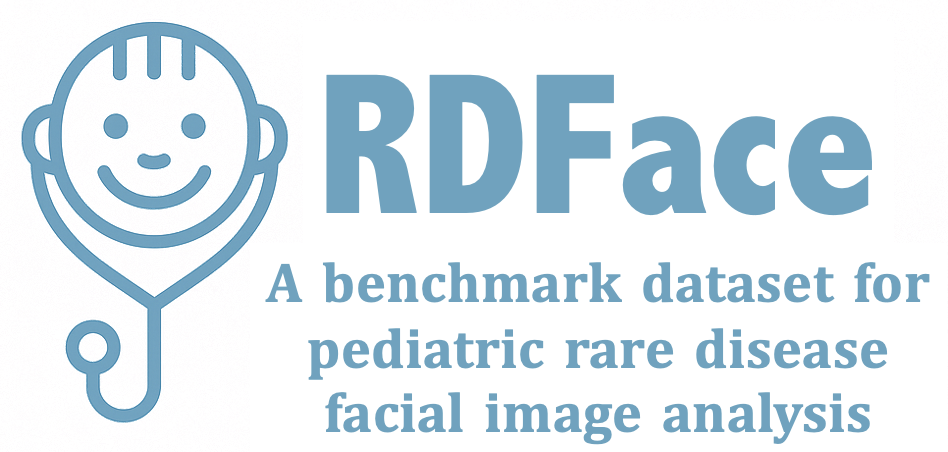

# RDFace: A Benchmark Dataset for Rare Disease Facial Image Analysis under Extreme Data Scarcity and Phenotype-Aware Synthetic Generation

<p align="center">
  
</p>

## Overview
This repository provides a modular framework for facial image analysis in the context of rare disease diagnosis, specifically tailored for use with the **RDFace** dataset. It supports data preprocessing, classification (few-shot and supervised), synthetic image generation, and LLM-based report generation.

---

## Dataset Access

RDFace includes both **real pediatric facial images** and **synthetic data**, released under a hybrid access model due to privacy considerations.

### Synthetic Data (Open Access)
- Freely available for research and benchmarking
- Available at: [RDFace-Syn](https://www.kaggle.com/datasets/ganlinfenggg/rdface-synthetic-data)

### Real Data (Controlled Access)
The real dataset contains identifiable facial images and is distributed under controlled access.

To request access:
[RDFace-Real](https://docs.google.com/forms/d/e/1FAIpQLSfcakuM938g_8gGv1nKpPCOlgEyeNgFvvGW2ieCpnMFmh5Zyg/viewform?usp=dialog)

- Approved users will receive a **Research ID**
- Access is granted only for approved research purposes (ethics approval (e.g., REB.IRB) required)

### Usage Policy
- Do not share or redistribute the data
- Do not attempt re-identification
- Must acknowledge this dataset in your research

**Note:** Any use without a valid Research ID is considered unauthorized.

---

## Installation

We recommend using a virtual environment (e.g. `conda` or `venv`). Then install the dependencies with:

```bash
pip install -r requirements.txt
```
> Some models (e.g. VGGFace, CLIP, or FastGAN) require external weights or additional dependencies as noted in each module’s README.

---

## Directory Overview

1. `data_processing/`: Scripts and utilities for preparing raw pediatric facial images and analyzing synthetic ones.

2. `supervised_classification/`: Conventional deep learning pipeline for facial phenotype classification.

3. `few_shot_learning/`: Implements few-shot classification methods for identifying phenotypic patterns in settings with limited data.

4. `synthetic_data_generation/`: Generates identity- and phenotype-consistent synthetic facial images to support training in low-data settings.

5. `llm_report_generation/`: Automates generation of clinical or research-style summaries from model outputs using large language models (LLMs).

---

### VGGFace Feature Extractor

We include a modified version of the VGGFace implementation from [ProgramComputer/VGGFace-pytorch](https://github.com/ProgramComputer/VGGFace-pytorch) in folder `models_vggface/`. The modifications include a renamed architecture class and a `FeatureExtractor` wrapper to support embedding extraction for facial similarity analysis.

> **Weights not included:**  
> Please follow the original GitHub instructions to download the pretrained VGGFace weights manually:
> [https://github.com/ProgramComputer/VGGFace-pytorch](https://github.com/ProgramComputer/VGGFace-pytorch)

After downloading, place the weight file (e.g., `vgg_face.pth`) in folder `models_vggface/` and update the path in your loading script.

---

## Reference
```bash
@inproceedings{rdface2026,
  title     = {RDFace: A Benchmark Dataset for Rare Disease Facial Image Analysis under Extreme Data Scarcity and Phenotype-Aware Synthetic Generation},
  author    = {Ganlin Feng, Yuxi Long, Hafsa Ali, Erin Lou, Fahad Butt, Qian Liu, Yang Wang, Pingzhao Hu},
  booktitle = {Proceedings of the IEEE/CVF Conference on Computer Vision and Pattern Recognition},
  year      = {2026}
}
```

---
## Acknowledgement
This work was supported in part by the Canada Research Chairs Tier II Program (CRC-2021-00482) and the Canada Foundation for Innovation John R. Evans Leaders Fund (JELF) program (#43481). All data collection procedures were approved by the Western University Health Science Research Ethics Board (HSREB) (Reference No. 2023-122744-77394). Facial photographs of children with rare diseases were collected from publicly available sources, including the published literature and foundation websites, and we gratefully acknowledge these sources.
